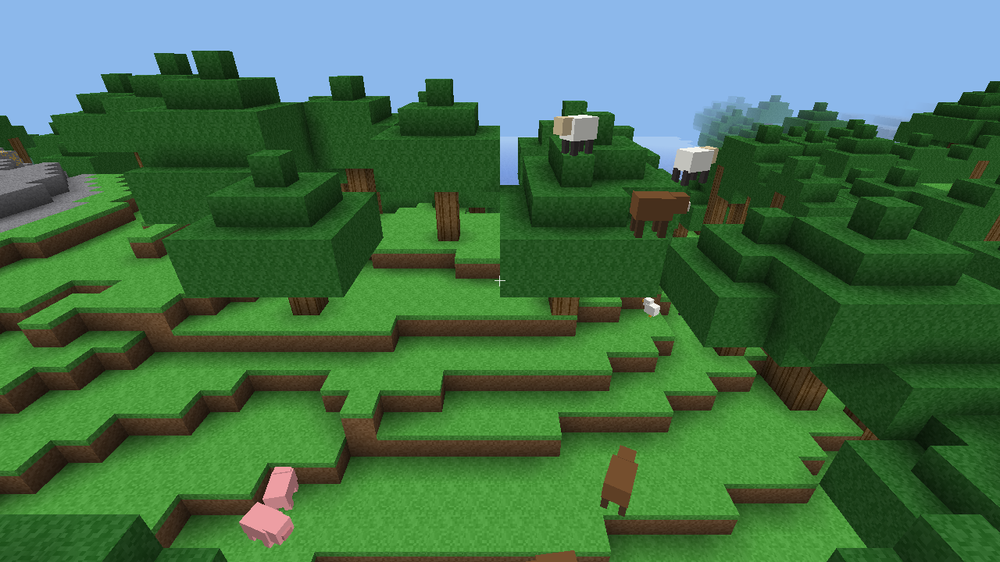
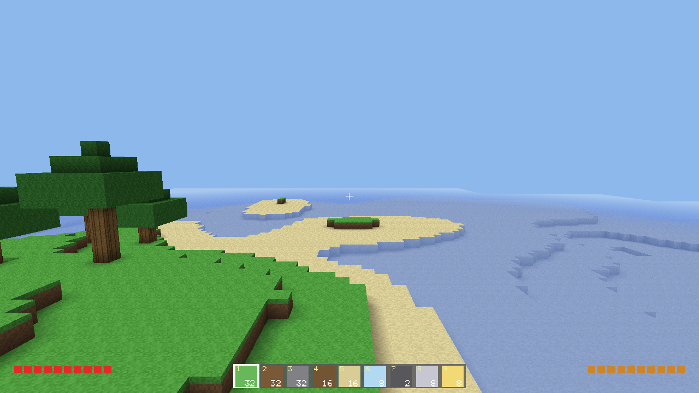
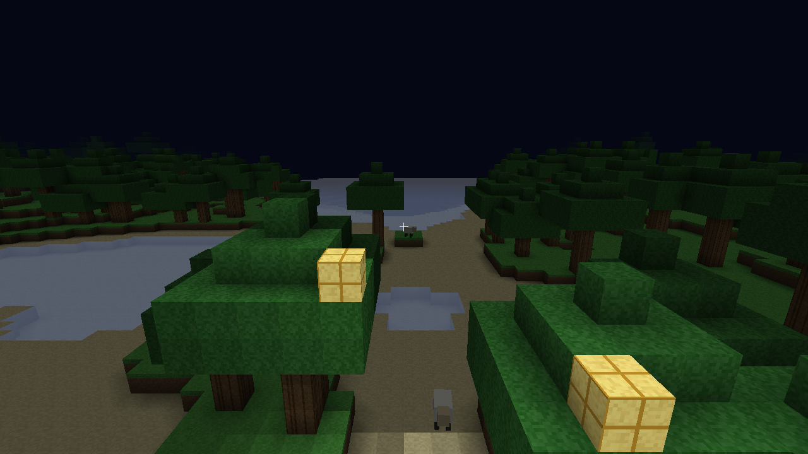
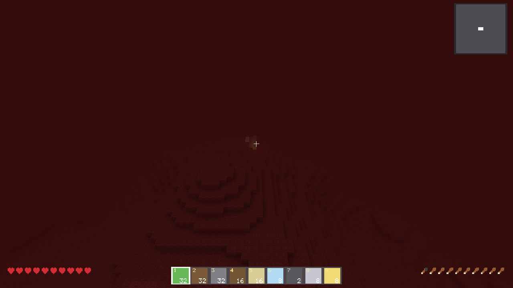

# Odin Minecraft Clone

A voxel sandbox written in **pure Odin** with OpenGL 4.1 + GLFW. No engine, no
external dependencies beyond the Odin toolchain and its `vendor` collection.


## Features

### World

- Chunked world (16×16×128 columns), streamed in/out around the player, saved
  per chunk (RLE) with a persistent seed.
- **Two dimensions** — the Overworld and a **Nether** (netherrack, lava seas,
  piglins, ghasts), reached through an obsidian **portal** you build (`P`).
- **13 biomes** — ocean, beach, plains, forest, desert, badlands, snow,
  mountains, savanna, swamp, taiga, jungle, meadow — placed on smooth
  temperature/humidity/altitude/maritime climate fields, so regions are large,
  coherent, and blend at their borders instead of snapping.
- Biome-shaped terrain (dunes, mesa strata, rolling hills, jagged peaks, marsh),
  sub-biome variants, surface rules (podzol, terracotta bands, mud, coarse dirt,
  gravel shores), and climate-varied coastlines.
- **Flora & scenery** — nine tree shapes spread across biomes, flowers, tall
  grass, ferns, dead bushes, cactus, bamboo, lily pads, sugar cane, pumpkin
  patches, mushrooms, mossy boulders, and underwater kelp, seagrass, and warm-
  water **coral reefs**.
- **Caves & ores** — 3-D-noise caves, lava-flooded depths, and coal / iron /
  gold / diamond ore at their own depth bands.
- **Structures** — multi-chunk **villages** (cottages, church, blacksmith,
  market, farm, park, animal pen, watchtower, well plaza) with villagers;
  scattered desert wells, igloos, and swamp huts; and underground **dungeons**
  with a mob spawner and loot chests.
- **Weather** — wet/dry spells with a storm level (light/normal/heavy) that
  reads per biome: drizzle or thunderstorm, snowfall or hail, desert sandstorm.
  Plus a volumetric drifting cloud deck and per-biome ambient particles.
- **Day-night cycle** — sun, moon, stars, dawn/dusk glow. Follows your real
  local clock by default, or a configurable day length.

### Play

- First-person controller: gravity, AABB collision, auto-step, **sprinting**
  (with FOV kick), **sneaking** (ledge-guard crouch), swimming with buoyancy
  and oxygen/drowning, and a noclip fly mode (`F`).
- Raycast (Amanatides–Woo) block **break** / **place** with a targeting outline,
  progressive breaking cracks, and break particles.
- **Combat & survival** — 20-HP hearts, hunger, knockback, fall/lava damage,
  i-frames, regen, attack cooldown with charged damage, death → respawn.
- **Mobs** — 25 kinds: farm animals, rabbits, horses; hostile zombies,
  skeletons (archers), piglins, ghasts; aquatic fish, squid, dolphins,
  pufferfish, jellyfish, turtles; and biome specialists (wolf, fox, deer, goat,
  llama, camel, snow leopard, cat, bee). Blocky multi-box models, leg
  animation, wander/chase AI, a predator/prey food chain, breeding and babies,
  aging, loot drops, and shore-seeking when they fall in water.
- **Villagers** — named NPCs with professions, dialogue (`R`), homes in a
  village, or nomads roaming free; farmers and guards drive predators off.
- **Tools & armor** — pickaxe / axe / shovel / sword and helmet / chestplate /
  leggings / boots, each in wood / stone / iron tiers, with durability, mining
  speed, damage, and damage reduction. Cycle the held tool with `H`.
- **Inventory** — fixed-slot stacks with drag/split, a tabbed panel (Items /
  Craft / Tools), and **chests** for persistent per-dimension storage.
- **Crafting & smelting** — a scrolling recipe list (torches, beds, chests,
  stairs, planks, cobble, brick, glass panes, ladders, walls, fence gates, dyed
  wool and carpets, obsidian); furnace recipes require standing near a Furnace.
- **Farming** — till ground into farmland, plant seeds, wheat grows in three
  stages, harvest for wheat and seeds, bake bread; sleep in a bed.
- **XP** — kills drop experience orbs that home in on you and fill a level bar;
  level and points persist across reloads.
- **Lighting** — flood-filled block light (0–15) from glowstone, torches, lava,
  and spawner cages, plus per-vertex ambient occlusion and sky shading.
- **HUD** — hearts, hunger, air bubbles, XP bar, hotbar, action-bar toasts, and
  a top-right **minimap**.
- **Sound** — procedurally synthesised SFX (break, place, footsteps, jump, mob
  hurt) via miniaudio; no audio files.
- **Menus** — title screen, settings (`O`), quit confirmation, and a
  dev/creative overlay (`` ` ``) to spawn mobs, give blocks, teleport to a
  biome/village/dimension, and set time, weather, or gear.
- **LAN multiplayer** — one host, many clients over TCP; the world is
  deterministic from the shared seed, so only block edits and player positions
  cross the wire.






## Requirements

- The [Odin](https://odin-lang.org) compiler (tested on `dev-2026-06`).
- macOS/Linux. GLFW and stb ship with Odin's `vendor` collection; on macOS the
  stb static libs may need building once:
  `make -C "$(dirname $(dirname $(readlink -f $(which odin))))/vendor/stb/src"`.

## Build & run

```sh
./build.sh            # generates the atlas, then builds ./mc
./mc                  # play
```

`build.sh debug` builds an unoptimised debug binary.

### Multiplayer

```sh
./mc --server [port]        # host (default port 25565)
./mc --connect host[:port]  # join
```

## Controls

| Input                | Action                                        |
|----------------------|-----------------------------------------------|
| `W A S D`            | Move                                          |
| Mouse                | Look                                          |
| `Space`              | Jump / swim up / fly up                       |
| `Left Shift`         | Sneak (crouch, won't walk off ledges) / fly down |
| `Left Ctrl` / double-tap `W` | Sprint                                |
| `F`                  | Toggle fly (noclip)                           |
| `1`–`9`              | Select hotbar slot                            |
| Left click           | Break block / hit mob                         |
| Right click / `Q`    | Place held block                              |
| `R`                  | Use: talk, feed, open chest, sleep, till, plant, harvest, toggle door, rotate stair |
| `H`                  | Cycle held tool                               |
| `E` / `T` / `X`      | Inventory / Craft / Tools tab                 |
| `C`                  | Quick-craft glowstone                         |
| `V`                  | Smelt near a furnace                          |
| `G`                  | Eat                                           |
| `P`                  | Build a nether portal (costs 14 obsidian)     |
| `O`                  | Settings menu                                 |
| `` ` ``              | Dev/creative overlay                          |
| Arrows / wheel       | Navigate menus / scroll recipe list           |
| `Enter`              | Start (title screen)                          |
| `Esc`                | Close menu, else quit-confirm (`Y` confirms; saves the world) |

Settings (`O`): mouse sensitivity, FOV, render distance, volume, day length,
real-time day/night, peaceful mode (no hostile spawns).

## Tests

```sh
odin test .           # ~100 tests: noise, chunks, raycast, collision, meshing,
                      # worldgen/biomes, save round-trip, inventory, crafting,
                      # mobs, villages, physics edge cases
```

## Environment knobs (testing / screenshots)

Harness hooks used by the headless smoke tests and for capturing docs images.

**Frame / camera / world**

- `MC_FRAMES=N` – render N frames then exit cleanly (headless smoke test).
- `MC_SHOT=path.png` – write a screenshot of the final frame.
- `MC_CAM="x,y,z,yaw,pitch"` – override the camera (enables fly).
- `MC_TIME=t` – pin the time of day (0=midnight, 0.5=noon).
- `MC_SCAN=1` – generate a region, print nearby biome coordinates, and exit.
- `MC_TPBIOME=<biome>` – teleport to the nearest chunk of that biome.
- `MC_VILLAGE=1` / `MC_SNOWVILLAGE=<biome>` – find, or force-build, a village.
- `MC_NETHER=1` / `MC_PORTAL=1` – start in the nether / build a lit portal ahead.
- `MC_RAIN=1|2|3` – force a storm at that level; `MC_FLASH=1` – lightning.

**Entities**

- `MC_MOBS=N` – force-spawn N animals ahead. `MC_NEWMOBS=1` – one of each
  land animal. `MC_NMOBS=N` – nether mobs. `MC_ZOMBIES=N` / `MC_SKELS=N`.
- `MC_AQUA=1` / `MC_FISH=N` / `MC_HORSE=1` – aquatic pool, fish, a horse.
- `MC_BABY=1` / `MC_BREED=1` / `MC_DEATH=1` – baby pair, feeding, dying mob.
- `MC_NPC=1` (+ `MC_NPCBIOME=snow|desert`) – a row of villagers.
- `MC_ITEMS=N` / `MC_PICKUP=1` – dropped items / one at your feet.

**Blocks & scenes**

- `MC_GLOW=1` / `MC_BUILD=1` / `MC_MATS=1` / `MC_WOOL=1` / `MC_TRIM=1` –
  glowstone, special blocks, craftables, wool + carpets, connecting trim.
- `MC_ORES=1` / `MC_STAIRS=1` / `MC_BED=1` / `MC_DOOR=1|open` / `MC_FARM=1`.
- `MC_PARTICLES=1` / `MC_DIVE=1` / `MC_EAT=1` – particle burst, underwater
  overlay, eating animation.

**UI**

- `MC_TITLE=1`, `MC_INV=1`, `MC_DRAG=1`, `MC_CRAFT=1`, `MC_TOOLS=1`,
  `MC_ARMOR=1`, `MC_CHESTUI=1`, `MC_SETTINGS=1`, `MC_QUITUI=1`,
  `MC_TOAST=<text>`, `MC_DEV=mobs|give|teleport|world`, `MC_TOOL=<name>`.

## Layout

Game code lives in the root `package main`, one file per system (`worldgen`,
`mesher`, `village`, `mob`/`entity`, `inventory`, `render`, …). `assetdef/`
holds the shared atlas layout; `tools/gen_atlas.odin` is a standalone Odin
program that paints `assets/atlas.png`; shaders live in `assets/shaders/` and
are embedded at compile time via `#load`. `docs/superpowers/specs/` holds the
original design doc (the initial scope — this README is the current state).
