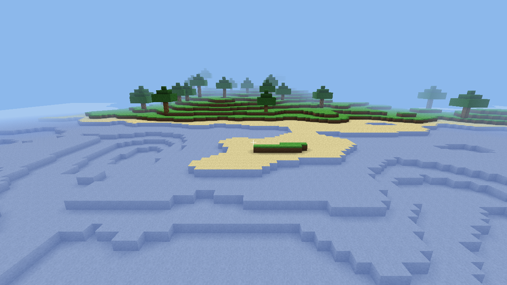

# Odin Minecraft Clone

A small voxel sandbox written in **pure Odin** with OpenGL 4.1 + GLFW.



## Features

- Chunked world (16×16×128 columns), streamed in/out around the player.
- Procedural terrain: fbm heightmap, biomes (plains / forest / desert / snow /
  mountains), sea-level water, 3-D-noise caves, sparse ore, and trees.
- Greedy-free face-culled meshing with per-vertex ambient occlusion and fake
  directional sky-shading.
- First-person controller: gravity, AABB collision, walking, jumping, and a
  noclip fly mode (`F`).
- Raycast (Amanatides–Woo) block **break** / **place** with a targeting outline.
- Translucent water pass, distance fog, textured atlas, crosshair HUD.
- World **save/load** (per-chunk RLE files) with a persistent seed.

## Requirements

- The [Odin](https://odin-lang.org) compiler (tested on `dev-2026-06`).
- macOS/Linux. GLFW and stb ship with Odin's `vendor` collection; on macOS the
  stb static libs may need building once:
  `make -C "$(dirname $(dirname $(readlink -f $(which odin))))/vendor/stb/src"`.

## Build & run

```sh
./build.sh            # generates the atlas, then builds ./mc
./mc                  # play
```

`build.sh debug` builds an unoptimised debug binary.

## Controls

| Input            | Action                    |
|------------------|---------------------------|
| `W A S D`        | Move                      |
| Mouse            | Look                      |
| `Space`          | Jump / fly up             |
| `Left Shift`     | Fly down                  |
| `F`              | Toggle fly (noclip)       |
| `1`–`9`          | Select hotbar block       |
| Left click       | Break block               |
| Right click      | Place selected block      |
| `Esc`            | Quit (saves the world)    |

## Tests

```sh
odin test .           # noise, chunk indexing, raycast, collision, meshing, save round-trip
```

## Environment knobs (testing / screenshots)

- `MC_FRAMES=N` – render N frames then exit cleanly (headless smoke test).
- `MC_SHOT=path.png` – write a screenshot of the final frame.
- `MC_CAM="x,y,z,yaw,pitch"` – override the camera (enables fly).
- `MC_SCAN=1` – generate a region, print nearby biome coordinates, and exit.

## Layout

Game code lives in the root `package main`. `assetdef/` holds the shared atlas
layout; `tools/gen_atlas.odin` is a standalone Odin program that paints
`assets/atlas.png`; shaders live in `assets/shaders/` and are embedded at
compile time via `#load`. See `docs/superpowers/specs/` for the design.
